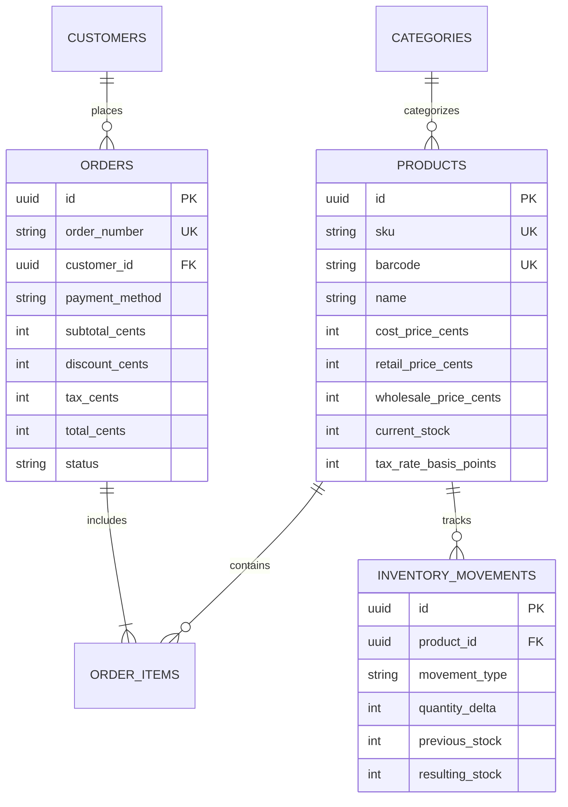

# PyME Manager Core

<p align="left">
  <strong>Lightweight, Deterministic TypeScript & SQL Relational Engine for Retail Inventory, Point-of-Sale (POS) & Mexican Tax Reconciliation</strong><br>
  Open-Source Core by <a href="https://github.com/Xaol-Studio"><strong>XAOL Software Studio</strong></a> · Mexico City / State of Mexico
</p>

<p align="left">
  <a href="https://github.com/Xaol-Studio/pyme-manager-core/actions/workflows/ci.yml"></a>
  <a href="https://github.com/Xaol-Studio"></a>
  
  
  <a href="LICENSE"></a>
</p>

---

## 📌 Architectural Overview

Most small-to-medium enterprise (PyME) point-of-sale systems suffer from two chronic engineering flaws:
1. **Floating-point rounding errors:** Storing prices as standard IEEE 754 floats (`0.1 + 0.2 !== 0.3`), causing penny discrepancies between cash register balances and SAT electronic invoices.
2. **Brittle database schemas:** Unindexed SKU searches and lack of atomic inventory movement logging (kardex), leading to phantom stock and warehouse desynchronization.

`@xaol/pyme-manager-core` is the foundational TypeScript and relational SQL engine powering the **PyME Manager** platform at [XAOL Software Studio](https://github.com/Xaol-Studio). It is engineered for deterministic execution, zero floating-point drift, and sub-millisecond barcode lookup.

---

## 🏗️ Relational Database Schema (ERD)

Both production-ready PostgreSQL (`sql/postgres_schema.sql`) and embedded SQLite (`sql/sqlite_schema.sql`) DDLs are provided:



---

## ⚡ Key Engineering Features

- **Integer-Cents Financial Math:** All monetary values (`cost`, `retail`, `wholesale`, `tax`, `subtotal`, `total`) are handled in integer cents (e.g. `$1,450.50 MXN` = `145050`), eliminating rounding drift across lines.
- **Mexican Tax Engine (SAT Anexo 20):** Native support for standard 16% IVA, 8% border stimulus, and 0%/exempt tax rates with half-up rounding.
- **Atomic Stock Checks:** Cart operations reject quantities that exceed available stock, throwing typed errors before database transaction commit.
- **Customer Price Tiers:** Instant switching between `RETAIL`, `WHOLESALE`, and `MECHANIC` pricing tiers for auto-parts counters and trade suppliers.
- **$O(1)$ In-Memory Indexing:** Fast dual-index lookup (`Map<string, Product>`) by both SKU and EAN/UPC barcode.
- **Deep-Linked WhatsApp Quoter:** Generates formatted markdown quotes and deep links (`https://wa.me/`) ready for instant sales closing.

---

## 📁 Repository Structure

```
pyme-manager-core/
├── .github/workflows/ci.yml       # Multi-version Node.js CI test suite
├── sql/
│   ├── postgres_schema.sql        # Production PostgreSQL schema with CHECK constraints
│   └── sqlite_schema.sql          # Offline-first SQLite schema for edge terminals
├── src/
│   ├── types.ts                   # Domain interfaces, Enums, and Cart models
│   ├── money.ts                   # Integer-cents arithmetic and currency formatters
│   ├── tax.ts                     # Mexican IVA aggregator and calculator
│   ├── cart.ts                    # Transactional POS cart state machine
│   ├── inventory.ts               # In-memory O(1) catalog index and search
│   ├── quote.ts                   # Formatted WhatsApp quote generator
│   └── index.ts                   # Public library exports
├── tests/
│   ├── money.test.mjs             # Financial math unit tests
│   ├── tax.test.mjs               # SAT tax reconciliation unit tests
│   └── cart.test.mjs              # POS cart and stock boundary unit tests
├── package.json
├── tsconfig.json
├── LICENSE
└── README.md
```

---

## 🚀 Quickstart & Usage

### 1. Installation
```bash
git clone https://github.com/Xaol-Studio/pyme-manager-core.git
cd pyme-manager-core
```

### 2. Run Tests
```bash
node --test tests/*.test.mjs
```

### 3. TypeScript Example: POS Cart & Quote
```typescript
import { PosCart, InventoryCatalog, formatQuoteText } from '@xaol/pyme-manager-core';

// 1. Initialize catalog
const catalog = new InventoryCatalog([
  {
    id: 'prod-01',
    sku: 'BALATAS-CER-01',
    barcode: '7501234567890',
    name: 'Balatas Delanteras Cerámicas',
    categoryId: 'cat-frenos',
    costPriceCents: 28000,
    retailPriceCents: 45000,    // $450.00 MXN
    wholesalePriceCents: 38000, // $380.00 MXN
    currentStock: 12,
    minStockAlert: 3,
    taxRateBasisPoints: 1600,   // 16% IVA
    isActive: true,
  }
]);

// 2. Lookup product by barcode in O(1)
const product = catalog.findByBarcode('7501234567890');

// 3. Create cart with Mechanic/Wholesale tier
const cart = new PosCart('MECHANIC');
cart.addItem(product!, 2);

// 4. Compute financial summary
const summary = cart.getSummary();
console.log(`Subtotal: $${summary.subtotalCents / 100} MXN`); // $760.00
console.log(`IVA 16%: $${summary.totalTaxCents / 100} MXN`);   // $121.60
console.log(`Total: $${summary.grandTotalCents / 100} MXN`);   // $881.60

// 5. Generate formatted WhatsApp quote text
const quoteMsg = formatQuoteText('Refaccionaria Xhala', summary, 'Taller Don Pepe');
console.log(quoteMsg);
```

---

## 🧪 Test Suite Coverage

The project uses Node.js native test runner (`node:test` and `node:assert/strict`), ensuring zero third-party testing dependencies:

- ✅ Exact decimal-to-cents parsing and string currency localization.
- ✅ Half-up rounding consistency on basis point tax calculations.
- ✅ Multi-tier pricing adjustments (`RETAIL` vs `WHOLESALE` / `MECHANIC`).
- ✅ Inventory boundary checks (throws on stock deficit).
- ✅ $O(1)$ catalog searches by SKU and EAN barcode.

---

## 📄 License & Attribution

Distributed under the **MIT License**. Engineered with pride in Mexico by **XAOL Software Studio**.

- **Lead Architect:** Ian Miguel Delgado Huitrón ([@iamhuitron](https://github.com/iamhuitron))
- **Organization:** [github.com/Xaol-Studio](https://github.com/Xaol-Studio)
- **Live Demonstrator:** [xaol-website.vercel.app/demo/pyme-manager.html](https://xaol-website.vercel.app/demo/pyme-manager.html)
